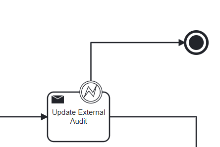
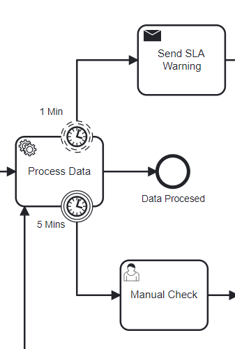
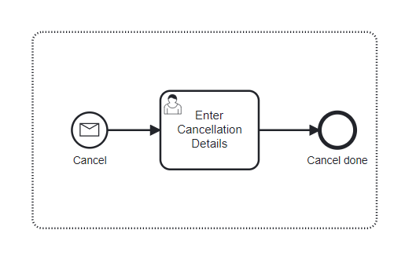

# Camunda 8 Code Example
This contains 2 main elements, the Job Worker which represents custom microserivces and a BPMN model which orchestrates those services.
This is a nice example to see how you might connect up a Java application to Camunda 8. 


## Setting you Camunda 8 Cluster
The fastest way to do it is to use the free trail of Camunda 8 SaaS. To start one you can [go here](https://bit.ly/3wzLViG) and register for an account. From there setting up a cluster just requires you to click the `Create Cluster` button

## Deploying the Models
Once you have you're account you can deploy the models found in the `BPMN_DMN` folder. This is just done by going to the modeler section of your Camunda 8 account and uploading the modeles and deploying them both to the cluster - this involves clicking the `Deploy` button once the model has been uploaded. 

## Starting the Worker.
To start the worker you'll need to [create and API key](https://docs.camunda.io/docs/self-managed/identity/user-guide/adding-an-api/) for it and then add the credentials to the `application.yaml` replacing the ones that are currently there. 

From there just load the project in you IDE of choice and run the `Worker` class

## Starting the process.

You can start the process by going to the modeler and opening the model - after you deploy it you can click start instance. You'll need to add the following JSON to the starting payload 

```JSON
{"complexity" : "High"}
``` 

## Important Process Details

I've built process with a view to highlighting quite specific patterns. These are patters that make what would normally be considering quite a complex coding challenge into something very easy to design, implement and execute. 

### BPMN Error Event


There are two categories of errors that you can expect to have in a given process. Technical errors (e.g. 404 response from a rest call) and Business Errors (e.g. A delivery can't be made to a given location). 

Technical errors are caught by the engine and presented to an admin to be solved, while business errors should be considered a predictable part of the process that can be handled with through modeling.

In this example I have a `Send Task` which has an `Error Boundary Event` attached to it, leading to a `Terminate Event`. The idea here is that if the service being called by the Task is unable to successfully complete it sends an error event back to the engine, which is then "caught" by the boundary event - the token then proceeds to the terminate event which will end the whole process.

This works by having the service send back a named error like this

```Java
client.newThrowErrorCommand(job.getKey())
                        .errorCode("Problem")
                        .errorMessage("Something bad happened and it was your fault")
                        .send()
                        .exceptionally((throwable -> {
                            throw new RuntimeException("Could not throw the BPMN Error Event", throwable);
                        }));
```
the boundary event is set to receive and error with the code `Problem` and so it's correlated by the engine.

If you want to test out this error in this example simple start the process with the following payload and watch the magic happen

```JSON
{"complexity" : "High",
"throwError" : true}
``` 

### Timer Events


This pattern is a pattern of gradual escalation over time. 
The task `Process Data` has two timer events attached to it. On the top there is a `Non-Interrupting Timer Boundary Event` which will trigger each minute. This creating a parallel flow which will `Send SLA Warning` without affecting the working being done by the `Process Data` Task. 

The bottome of the task has a 5 minute `Interrupting Timer Boundary Event` unlike the over event, if this is triggered it will interrupt that task and move the flow to the `Manual Check Task`

I you'd like to try to this out you can determine how long Process Data will run for by adding the following variable to the payload when starting the process. 

```JSON
{"complexity" : "High",
"minutes" : 6}
``` 

### Event Sub process


Easily my favorite patterns in BPMN involve the event subprocess, here i've added a fairly simple use case but its still very valuable. 

Here we have an `Event Sub Process` which is triggered by an `Interrupting Message Start Event`. From the moment the process begins until it ends this is waiting for this message to be sent. Messages can be sent by other other processes or via API to the engine. Once correlated with a name and key it will interrupt whatever is going on in the process, canceling all active tasks and activating the `Enter Cancellation Details` task. 

In this case the message name is `CancelMessage` and the key is hardcoded as `CANCEL` 

