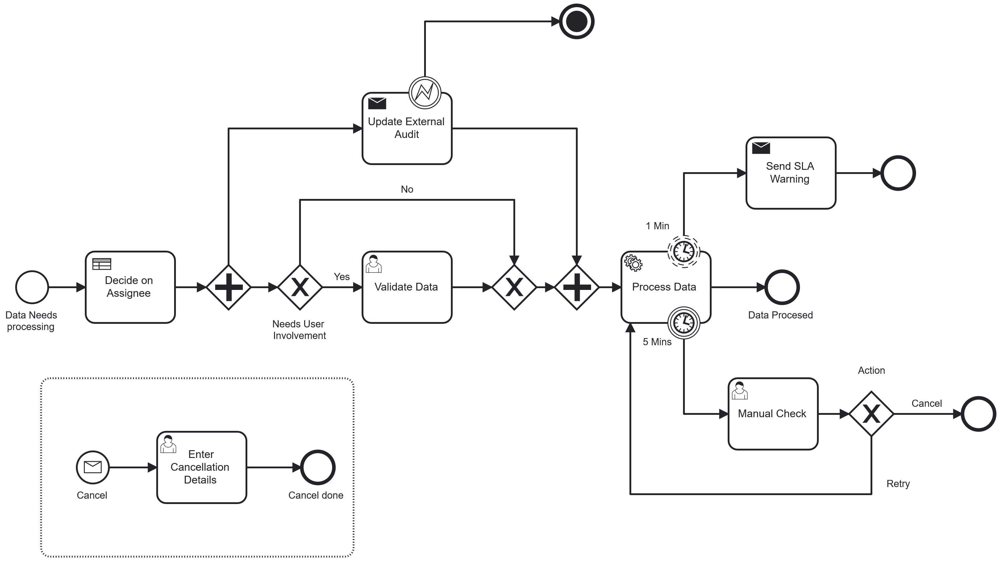

# Camunda 8 Code Example
This contains 2 main elements, the Job Worker which represents custom microserivces and a BPMN model which orchestrates those services.
This is a nice example to see how you might connect up a Java application to Camunda 8. 



## Setting you Camunda 8 Cluster
The fastest way to do it is to use the free trail of Camunda 8 SaaS. To start one you can [go here](https://bit.ly/3wzLViG) and register for an account. From there setting up a cluster just requires you to click the `Create Cluster` button

## Deploying the Models
Once you have you're account you can deploy the models found in the `BPMN_DMN` folder. This is just done by going to the modeler section of your Camunda 8 account and uploading the modeles and deploying them both to the cluster - this involves clicking the `Deploy` button once the model has been uploaded. 

## Starting the Worker.
To start the worker you'll need to [create and API key](https://docs.camunda.io/docs/self-managed/identity/user-guide/adding-an-api/) for it and then add the credentials to the `application.yaml` replacing the ones that are currently there. 

From there just load the project in you IDE of choice and run the `Worker` class

## Starting the process.

You can start the process by going to the modeler and opening the model - after you deploy it you can click start instance. You'll need to add the following JSON to the starting payload 

```JSON
{"complexity" : "High"}
``` 
